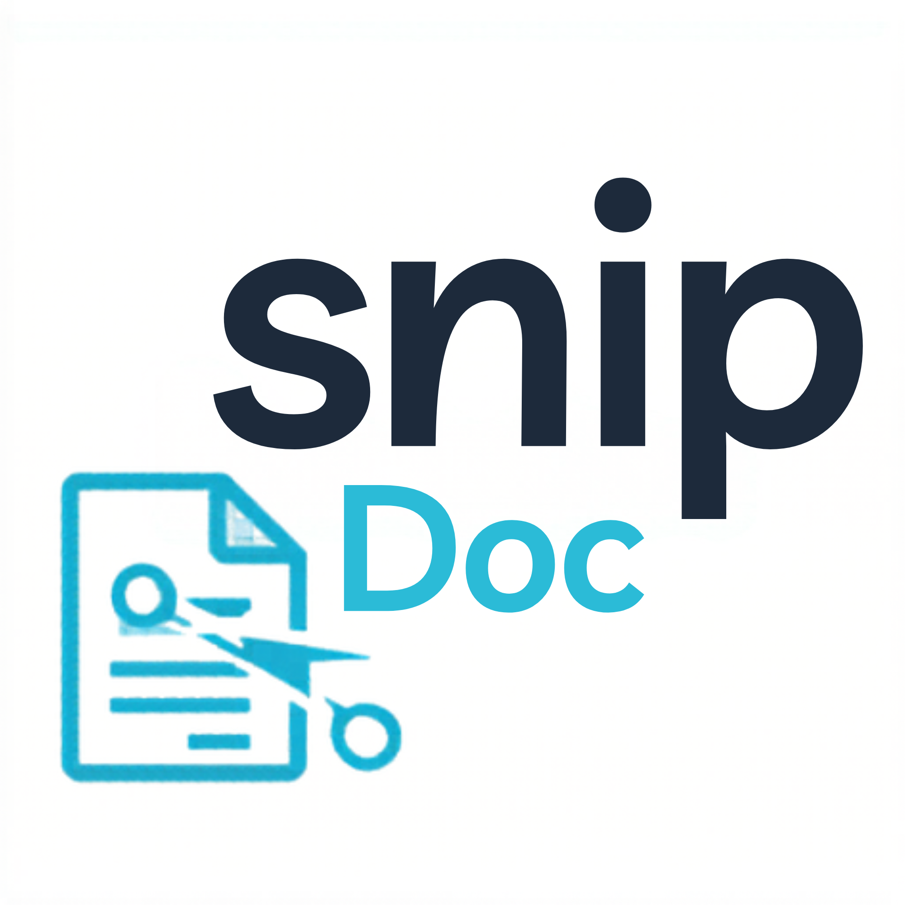

<div align="center">



# SnipDoc ✂️

**Precision cropping and resizing for PDFs and images — right on your desktop.**

[](https://www.python.org/)
[](https://www.riverbankcomputing.com/software/pyqt/)
[](LICENSE)
[](https://github.com/unisimplex/snipdoc/pulls)

[Getting Started](#-installation) · [Features](#-features) · [Usage](#-usage) · [Contributing](#-contributing)

</div>

---

## What is SnipDoc?

SnipDoc is a clean, modern desktop tool for cropping and resizing **PDFs**, **JPGs**, and **PNGs** with pixel-perfect accuracy. Whether you're trimming whitespace from a scanned document, extracting a region from an image, or resizing assets for print or screen — SnipDoc gets it done without the bloat.

Built with **PyQt6** for a smooth native UI and powered by **PyMuPDF** for fast, high-quality rendering.

---

## Features

| | Feature |
|---|---|
| 📄 | Crop individual PDF pages with precision |
| 🖼️ | Crop JPG and PNG images |
| 📐 | Resize PDFs and images to exact custom dimensions |
| 📏 | Multi-unit support — **cm, mm, inches, pixels** |
| 🔒 | Optional aspect ratio lock |
| ⚡ | Fast rendering via PyMuPDF |
| 💾 | Export as PDF, JPG, or PNG |
| 🖥️ | Clean, modern PyQt6 interface |

---

## Tech Stack

- **GUI** — [PyQt6](https://www.riverbankcomputing.com/software/pyqt/)
- **PDF Processing** — [PyMuPDF](https://pymupdf.readthedocs.io/)
- **Image Processing** — [Pillow](https://python-pillow.org/)
- **Dependency Management** — [uv](https://github.com/astral-sh/uv)
- **Runtime** — Python 3.9+

---

## Installation

### Prerequisites

Make sure you have **Python 3.9+** and **uv** installed.

```bash
pip install uv
```

### Steps

```bash
# 1. Clone the repository
git clone https://github.com/unisimplex/snipdoc.git
cd snipdoc

# 2. Install dependencies and create virtual environment
uv sync

# 3. Launch the app
uv run python main.py
```

That's it. No manual venv setup, no dependency headaches.

---

## Usage

1. **Open** a PDF or image file via the toolbar
2. **Select** a region on the canvas using click-and-drag
3. **Crop** the selection or **Resize** the document to custom dimensions
4. Choose your preferred unit — cm, mm, inches, or pixels
5. **Export** the result as PDF, JPG, or PNG

---

## Project Structure

```
snipdoc/
├── main.py              # Entry point
├── main_window.py       # Main UI layout and controls
├── canvas_widget.py     # Rendering engine and selection logic
├── pdf_handler.py       # PDF & image processing backend
├── resources/           # Icons and static assets
├── requirements.txt
├── pyproject.toml
└── README.md
```

---

## Build (Optional)

Package SnipDoc into a standalone executable using PyInstaller:

```bash
pyinstaller SnipDoc.spec
```

The binary will be output to the `dist/` folder — ready to ship.

---

## Contributing

Contributions, bug reports, and feature requests are welcome.

1. Fork the repository
2. Create your branch: `git checkout -b feature/your-feature`
3. Commit your changes: `git commit -m 'Add your feature'`
4. Push to the branch: `git push origin feature/your-feature`
5. Open a Pull Request

Please keep PRs focused and well-described.

---

## License

Distributed under the **MIT License**. See [`LICENSE`](LICENSE) for details.

---

<div align="center">

If SnipDoc saves you time, consider giving it a ⭐ — it helps more than you'd think.

</div>
